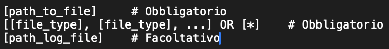
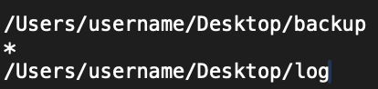
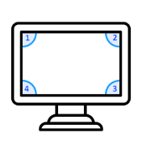

[](https://classroom.github.com/online_ide?assignment_repo_id=15469138&assignment_repo_type=AssignmentRepo)
<div id="top"></div>
<!--
*** Thanks for checking out the Best-README-Template. If you have a suggestion
*** that would make this better, please fork the repo and create a pull request
*** or simply open an issue with the tag "enhancement".
*** Don't forget to give the project a star!
*** Thanks again! Now go create something AMAZING! :D
-->


<!-- PROJECT LOGO -->
<br />
<div align="center">
  <a href="https://github.com/github_username/repo_name">
    
  </a>

<h3 align="center">Backup Emergency</h3>

  <p align="center">
    A cross-platform application that triggers automatic backups using mouse gestures, ensuring quick and seamless data protection with minimal CPU impact.
    <br />
    <a href="https://github.com/ProgrammazioneDiSistema2024-IA-ZZ/Group-33"><strong>Explore the docs »</strong></a>
    <br />
    <br />
    <a href="https://github.com/ProgrammazioneDiSistema2024-IA-ZZ/Group-33">View Demo</a>
    ·
    <a href="https://github.com/ProgrammazioneDiSistema2024-IA-ZZ/Group-33/issues">Report Bug</a>
    ·
    <a href="https://github.com/ProgrammazioneDiSistema2024-IA-ZZ/Group-33/issues">Request Feature</a>
  </p>
</div>


<!-- TABLE OF CONTENTS -->
<details>
  <summary>Table of Contents</summary>
  <ol>
    <li>
      <a href="#about-the-project">About The Project</a>
      <ul>
        <li><a href="#built-with">Built With</a></li>
      </ul>
    </li>
    <li>
      <a href="#getting-started">Getting Started</a>
      <ul>
        <li><a href="#prerequisites">Prerequisites</a></li>
        <li><a href="#installation">Installation</a></li>
      </ul>
    </li>
    <li><a href="#usage">Usage</a></li>
    <li><a href="#contributing">Contributing</a></li>
    <li><a href="#contact">Contact</a></li>
  </ol>
</details>


<!-- ABOUT THE PROJECT -->
## About The Project

<div style="text-align: center;">
  
</div>

This application provides an intuitive backup solution activated by mouse gestures, enabling users
to securely back up their data even when the screen is inaccessible. Designed for simplicity and
efficiency, it runs seamlessly across Windows, macOS, and Ubuntu, with minimal resource usage and
robust logging for performance tracking.

<p align="right">(<a href="#top">back to top</a>)</p>


### Built With

* [Rust](https://www.rust-lang.org/it)


<p align="right">(<a href="#top">back to top</a>)</p>


<!-- GETTING STARTED -->
## Getting Started

This is an example of how you may give instructions on setting up your project locally.
To get a local copy up and running follow these simple example steps.

### Prerequisites

This is an example of how to list things you need to use the software and how to install them.
* cargo
  ```sh
  rustup update
  ```

### Installation

1. Clone the repo
   ```sh
   git clone https://github.com/ProgrammazioneDiSistema2024-IA-ZZ/Group-33.git
   ```
2. Build the project
   ```sh
   cargo build
   ```
3. Setup config file following this template
    
    Example: 

    

4. Run the project
   ```sh
   cargo run [path to config file]
   ```

<p align="right">(<a href="#top">back to top</a>)</p>


<!-- USAGE EXAMPLES -->
## Usage

### 1. Trigger backup
- Use your mouse to draw a rectangle that touches all four corners of the screen, starting from the top-left corner and proceeding clockwise.
  


- Once the pattern is recognized, the application will enter the Confirming state.
### 2. Confirm or Cancel the Backup
- To confirm, draw a line from the bottom-left corner to the bottom-right corner of the screen.


- To cancel, return the mouse to the top-left corner.
  


### 3. View Confirmation Window
If a screen is accessible, a confirmation window will appear during the Confirming state. Use the system’s close button or mouse gestures to interact with the window.
### 4. Monitor Logs
- The application generates two logs:
- - Performance log: Tracks CPU usage every two minutes.
- - Backup log: Includes details like the total size and duration of the backup.
    Logs can be found in the directory specified in the config.toml file.
### 5. Modify Configuration
- The application uses a config.toml file to manage settings like the source and destination directories, file types to back up, and log locations.
- If no configuration file is provided, a default one is created during the first run.

<p align="right">(<a href="#top">back to top</a>)</p>


<!-- CONTRIBUTING -->
## Contributing

Contributions are what make the open source community such an amazing place to learn, inspire, and create. Any contributions you make are **greatly appreciated**.

If you have a suggestion that would make this better, please fork the repo and create a pull request. You can also simply open an issue with the tag "enhancement".
Don't forget to give the project a star! Thanks again!

1. Fork the Project
2. Create your Feature Branch (`git checkout -b feature/AmazingFeature`)
3. Commit your Changes (`git commit -m 'Add some AmazingFeature'`)
4. Push to the Branch (`git push origin feature/AmazingFeature`)
5. Open a Pull Request

<p align="right">(<a href="#top">back to top</a>)</p>


<!-- CONTACT -->
## Contact

Ivaldi Miriam&nbsp;&nbsp;&nbsp;&nbsp;&nbsp;&nbsp;&nbsp;&nbsp;&nbsp;&nbsp;&nbsp;&nbsp;&nbsp;&nbsp;&nbsp;&nbsp;&nbsp;&nbsp;&nbsp;&nbsp;&nbsp;&nbsp;miriamivaldi1@gmail.com  
Moracci Leonardo&nbsp;&nbsp;&nbsp;&nbsp;&nbsp;&nbsp;&nbsp;&nbsp;&nbsp;&nbsp;&nbsp;&nbsp;&nbsp;moracci99@gmail.com  
Muccilli Paolo&nbsp;&nbsp;&nbsp;&nbsp;&nbsp;&nbsp;&nbsp;&nbsp;&nbsp;&nbsp;&nbsp;&nbsp;&nbsp;&nbsp;&nbsp;&nbsp;&nbsp;&nbsp;&nbsp;&nbsp;muccilli2000.pm@gmail.com  
Porcheddu Massimo&nbsp;&nbsp;&nbsp;&nbsp;&nbsp;&nbsp;&nbsp;&nbsp;&nbsp;maximo.1997.lib@gmail.com


Project Link: [https://github.com/ProgrammazioneDiSistema2024-IA-ZZ/Group-33](https://github.com/ProgrammazioneDiSistema2024-IA-ZZ/Group-33)

<p align="right">(<a href="#top">back to top</a>)</p>


